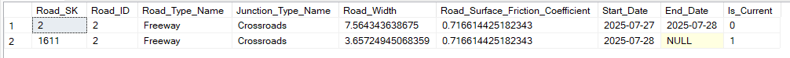
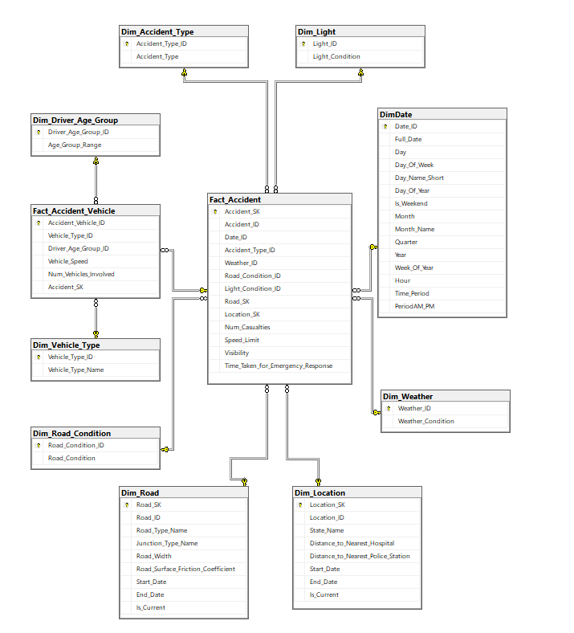

# Data Warehouse

This folder contains the **Data Warehouse schema** designed and built for analyzing road accident data across the US.

##  Dimensional Design Strategy

### 1. **Select the Business Process**
I modeled the data warehouse around the **accident reporting process**, with two fact tables:
- `Fact_Accident`: One row per accident event
- `Fact_Accident_Vehicle`: One row per vehicle involved in an accident

### 2. **Declare the Grain**
- `Fact_Accident`: One row = One accident event
- `Fact_Accident_Vehicle`: One row = One vehicle in one accident

This ensures clarity and consistency in measure aggregation.

### 3. **Identify the Dimensions**
Dimension tables were created for all lookup attributes to enable filtering and slicing:
- Time-based: `DimDate` (with date, hour, period)
- Categorical: `Dim_Accident_Type`, `Dim_Weather`, `Dim_Road_Condition`, `Dim_Light`
- `Dim_Location`(Combines location with state),
`Dim_Road`(Combines road features with types and junction types)
- `Dim_Vehicle_Type`, `Dim_Driver_Age_Group`

### 4. **Define the Facts**
- `Num_Casualties`
- `Speed_Limit`
- `Visibility`
- `Time_Taken_for_Emergency_Response`
- `Vehicle_Speed`
- `Num_Vehicles_Involved`

##  Key Features

### 🔁 Slowly Changing Dimension (Type 2)
We applied **SCD Type 2** in `Dim_Location` & `Dim_Road` to track changes over time in fields like:
- `Distance_to_Nearest_Hospital`
- `road_width`

It includes:
- `Start_Date`, `End_Date`
- `Is_Current` flag

Below is an example of how the `Dim_Road` table stores history when a road's attributes change (e.g., road width):

### Time Intelligence
The `DimDate` table includes:
- Hour of accident (derived)
- Time Period: Morning / Afternoon / Night / Evening
- AM/PM field for clarity

##  Star Schema Overview

