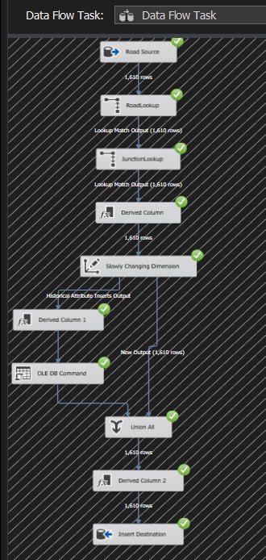
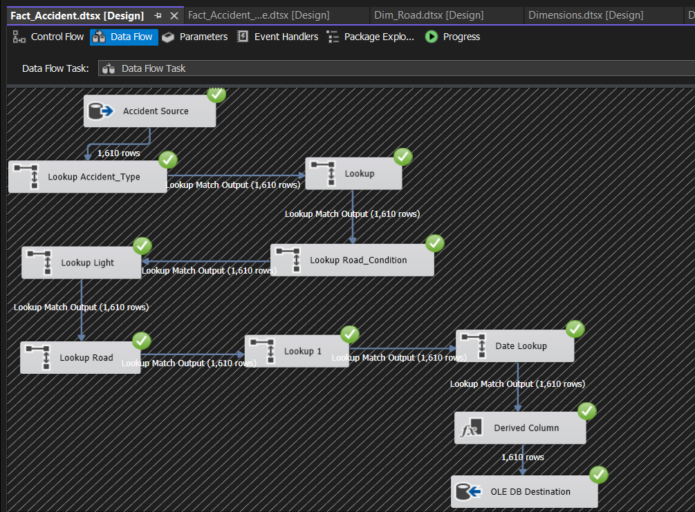
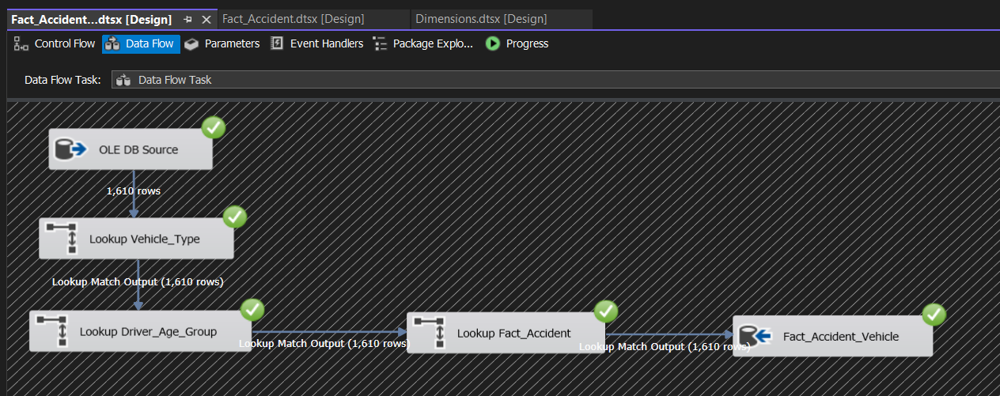

# SSIS ETL Pipeline

### Overview

This SSIS ETL pipeline extracts data from the raw operational accident database, transforms it (cleansing, type conversion, enrichment), and loads it into a star-schema dimensional model built in SQL Server.

### 🧩 What’s Included

- Data Flow Tasks for each **dimension** and **fact table**
- Lookup-based **foreign key resolution**
- Derived columns for **data enrichment** (e.g., extracting hour from time)
- Conditional splits for basic **data validation**
- SCD Type 2 handling for historical dimension (`Dim_Location` & `Dim_Road`)

### ⚙️ Pipeline Structure

Each dimension and fact was handled in a separate Data Flow Task:

| Table                  | SCD Type | Notes |
|------------------------|----------|-------|
| `Dim_Weather`          | Type 1   | Basic insert after deduplication |
| `Dim_Light`            | Type 1   | Basic insert |
| `Dim_Road_Condition`   | Type 1   | Cleaned text and inserted |
| `Dim_Accident_Type`    | Type 1   | Simple mapping |
| `Dim_Vehicle_Type`     | Type 1   | Flat lookup table |
| `Dim_Driver_Age_Group` | Type 1   | Flat lookup table |
| `Dim_Road`             | Type 2   | Merged `Road`, `Road_Types`, and `Junction_Types` using lookups, 	Tracked historical date using Derived Column + OLE DB Command |
| `Dim_Location`         | Type 2   | Tracked changes using Derived Column + OLE DB Command |
| `DimDate`              | Pre-loaded | Used as a master calendar table |
| `Fact_Accident`        | Fact     | Lookups to all related dimensions including extracted Hour |
| `Fact_Accident_Vehicle`| Fact     | Includes vehicle speed and involvement count |

---

### 💡 Key Features

#### ✅ Data Cleaning & Transformations

- Handled time fields via derived column to extract `Hour` for `Fact_Accident`
- Used TRIM + UPPER to normalize AM/PM for accurate 24-hour conversion
- Applied type casting (e.g., from `DT_DBTIME2` to string → int for hour logic)
- Error Handling with Derived Columns + Conditional Splits to filter incomplete/malformed data

#### 🔁 SCD Type 2 (Dim_Location & Dim_Road)

- `Is_Current`, `Start_Date`, `End_Date` columns managed manually
- Used:
  - Conditional Split for changed vs unchanged rows
  - OLE DB Command to update old rows
  - Derived Column to assign system date on insert

### 📌 Notes

- Raw data includes separated `Date`, `Time`, and `Period` columns
- `DimDate` is pre-populated with sufficient historical coverage
- Source `Road` table includes FK references to `Road_Types` and `Junction_Types`

### Suggestions for Future Work

1. Add centralized logging for failed rows
2. Add audit columns (Created_At, Updated_At) for traceability

